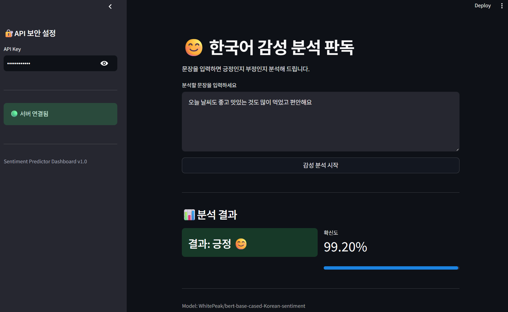
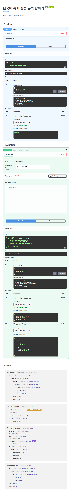

# 한국어 감성 분석기 구현
> 허깅페이스에서 처음으로 모델을 골라보고 배운것을 토대로 사용법을 익히려고 했습니다.
> 태스크는 text-classification 이고 bert-base-multilingual-cased을 Fine-tuning 한 모델입니다.
> 한국어 고객 리뷰를 기반으로 한국어 감성 분석을 위해 정교하게 조정된 모델입니다.

## 간단한 테스트
> 모델 소개 페이지에 간단하게 테스트 해 볼 수 있는 코드가 있었습니다.
```
from transformers import pipeline

sentiment_model = pipeline(model="WhitePeak/bert-base-cased-Korean-sentiment")
sentiment_mode("매우 좋아")
```
> 결과
```
LABEL_0: negative    # "부정" 으로 변경
LABEL_1: positive    # "긍정" 으로 변경함
```

## 버전 문제
> 테스트 코드가 에러가 났으며 파이토치 버전 2.6 이상으로 업그레이드 하였습니다.
```
# 1. 최신 PyTorch 2.6.0 이상 + CUDA 12.4 빌드 설치
!pip install --upgrade torch torchvision torchaudio --index-url https://download.pytorch.org/whl/cu124
```

## 스키마 설계
> - Pydantic, Schemas 검증 기능 구현 
> - Swagger UI docs 구현
> - `schemas.py`
```
pydantic 임포트
클래스 2개 (리퀘스트, 리스폰스)
리퀘스트: 입력
  텍스트 : str = Field(..., 최소 글자, 최대 글자, 설명)
  model_config = {Swagger UI 예시}
리스폰스: 출력
  성공여부
  라벨(긍정, 부정)
  확신도
  model_config = {Swagger UI 예시}
```
## 모델 로드 및 추론 함수
> `model_service.py`
```
클래스 없이 함수 2개 : load_model(), predict()
def load_model
  return 파이프라인(태스크, 모델명, 가중치, 디바이스)

def predict
  입력 데이터
  label_map - "긍정", "부정" 으로 스트링 변경
  return 라벨, 확신도
```
## FastAPI 구현
> `main.py`
```
logger 구현
app = FastAPI 구현
middleware 구현
error handler 구현
ThreadPook 별도 구현 (run in executor)

@ 런 온 이벤트 (서버 로드시 한번만 모델 로드)

@ predict
* 비동기 함수
* 입출력 명시
* tag 달아서 swagger 보강
* Depends 인증 요구
* run in executor 구현
* 리턴 : 성공여부, 라벨(긍정,부정), 확신도
```
## Streamlit API 구현
> `app.py`
```
* 페이지 컨피그 맨 처음에
* call_api 함수 별도 구축 get,post 분기 및 각종 예외 처리
* API 보안키 입력창 구현
* 서버 연결 표시등 구현
* 분석할 문장 입력창 구현
* 분석 결과 표시 영역 구현
* 각종 예외처리 구현
```

# 스크린샷

## Streamlit UI
---

## Swagger UI docs
---


